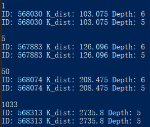
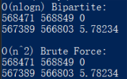

# 算法设计与分析 第2章

> 2016211308班 2016211352号 刘思聪

[GitHub链接](https://github.com/LiuSecone/Data-Structure/tree/master/aa-chapter2)

---

## 合并、快速排序实验

### 实验结果

#### 表1

> Qs1、Qs2、递归合并三项，前者为时间，单位为ms，后者为递归深度。

|编号|长度|组号|DD|ADD|Qs1|Qs2|递归合并|非递归合并|
|---|---|---|---|---|---|---|---|---|
|1|2000|1|3036|1|0.3046/521|0.0379/388|0.881/12|1.0422/12|
|2|2000|1|24766|12|0.085/200|0.0517/317|0.8865/12|0.8984/12|
|3|2000|1|225188|112|0.0462/63|0.0533/90|0.8889/12|1.0232/12|
|4|2000|1|910715|455|0.0941/23|0.1028/23|0.7834/12|0.7241/12|
|5|2000|1|1005288|502|0.1067/20|0.1039/19|0.7498/12|0.9102/12|
|6|5000|2|11491|2|2.7114/3228|1.2452/2474|2.3612/14|2.0583/14|
|7|5000|2|167275|33|0.3832/422|0.2319/311|2.2234/14|2.2893/14|
|8|5000|2|1399402|279|0.1694/100|0.1419/95|2.4486/14|2.0491/14|
|9|5000|2|5637831|1127|0.3089/28|0.2651/32|2.2088/14|1.882/14|
|10|5000|2|6181618|1236|0.3457/26|0.3279/24|2.4731/14|2.1322/14|
|11|10000|3|37749|3|3.7894/1433|1.8999/954|4.5747/15|3.7978/15|
|12|10000|3|644699|64|0.8036/549|1.175/796|4.2974/15|4.3105/15|
|13|10000|3|5906046|590|0.3054/115|0.3429/96|4.0679/15|4.1008/15|
|14|10000|3|22400354|2240|0.6392/30|0.5504/29|3.9688/15|4.6799/15|
|15|10000|3|25171709|2517|0.9454/31|0.6282/28|5.0488/15|4.2508/15|
|16|15000|4|116872|7|12.9873/4176|0.9121/599|6.4834/15|6.0191/15|
|17|15000|4|1597883|106|2.46/735|0.868/482|6.2859/15|6.5398/15|
|18|15000|4|12614636|840|0.3986/112|0.5171/108|5.9184/15|5.7398/15|
|19|15000|4|50630144|3375|0.8976/35|0.8675/30|6.7022/15|6.2155/15|
|20|15000|4|56788531|3785|0.9869/32|0.9814/35|6.5485/15|5.7303/15|
|21|20000|5|300896|15|11.3346/5034|8.3769/3328|8.1845/16|7.7147/16|
|22|20000|5|2563322|128|2.705/1063|1.911/635|8.8565/16|8.19/16|
|23|20000|5|22657537|1132|0.7645/145|0.7715/121|8.7079/16|8.2974/16|
|24|20000|5|90758969|4537|1.284/38|1.6845/33|8.3926/16|8.3132/16|
|25|20000|5|100284366|5014|1.2903/33|1.3124/32|8.2939/16|8.8624/16|
|26|30000|6|642539|21|12.2931/3781|6.1938/2933|13.0363/16|12.2231/16|
|27|30000|6|5760660|192|3.9609/788|2.3257/841|13.3251/16|12.2271/16|
|28|30000|6|51761785|1725|1.1788/141|1.005/145|13.4688/16|12.2142/16|
|29|30000|6|201918728|6730|2.4497/33|1.926/36|12.4618/16|12.0454/16|
|30|30000|6|223217104|7440|2.0816/31|2.2843/32|13.0046/16|13.711/16|

#### 表2

|长度|组号|avg DD|avg ADD|avg Qs1|avg Qs2|avg 递归合并|avg 非递归合并|
|---|---|---|---|---|---|---|---|
|2000|1|2.16899e+06|216.4|0.12732|0.06992|0.83792|0.91962|
|5000|2|1.33976e+07|535.4|0.78372|0.4424|2.34302|2.08218|
|10000|3|5.41606e+07|1082.8|1.2966|0.91928|4.39152|4.22796|
|15000|4|1.21748e+08|1622.6|3.54608|0.82922|6.38768|6.0489|
|20000|5|2.16565e+08|2165.2|3.47568|2.81126|8.48708|8.27554|
|30000|6|4.83301e+08|3221.6|4.39282|2.74696|13.0593|12.4842|

### 运行结果截图


### 结果总结

* 当问题规模相同，序列内容不变的时候，一般来说效率`Qs`>`Qs2`>`非递归归并`>`递归归并`。虽然两种排序方式都为*O(nlog(n))*，但是显然快速排序的常数小于归并排序。虽然在当前的数据下`Qs1`的效率大于`Qs2`，但是`Qs1`在逆序等情况下会发生退化，效率显著降低。

* 当问题规模不变的情况下，混乱程度过低，反而会因为很难将问题分为长度相似的两端而增加了递归深度，从而加长了排序时间。

* 当问题规模不同的情况下，数组混乱都取平均值。因为问题求解的复杂度为*O(nlog(n))*，可以看到时间会显著增加。

* 在数组有序度相对较高的情况下，在区间内随机选择一个作为中枢的排序方式因为可以将两部分划分的更加相近，因此效率更好。

### 代码

```c
#include <iostream>
#include <vector>
#include <random>
#include <chrono>
#include <algorithm>

#define REPEAT_TIMES 5

std::vector<int> creat_unsort_number(int length, int chaos_degree) {
    std::uniform_int_distribution<unsigned> u1(0, 30000);
    std::default_random_engine e;
    std::vector<int> unsort_number;
    for (int i = 0; i < length; ++i) {
        unsort_number.push_back(u1(e));
    }
    std:sort(unsort_number.begin(), unsort_number.end());
    std::uniform_int_distribution<unsigned> u(0, length - 1);
    int switch_times = static_cast<int>(length * pow(10, chaos_degree - 3));
    for (int i = 0; i < switch_times; ++i) {
        int swap1 = u(e);
        int swap2 = u(e);
        //std::cout << swap1 << ' ' << swap2 << std::endl;
        auto temp = unsort_number[swap1];
        unsort_number[swap1] = unsort_number[swap2];
        unsort_number[swap2] = temp;
    }
    return unsort_number;
}

void print_arr(const std::vector<int> &arr) {
    for (auto i : arr) {
        std::cout << i << ' ';
    }
    std::cout << std::endl;
}

int bipartite(std::vector<int> &unsort_number, int l, int r) {
    if (l == r) return 0;
    int mid = (l + r) >> 1;
    int dd = bipartite(unsort_number, l, mid) + bipartite(unsort_number, mid + 1, r);
    std::vector<int> tempvec1, tempvec2;
    for (auto i = l; i <= mid; ++i) {
        tempvec1.push_back(unsort_number[i]);
    }
    for (auto i = mid + 1; i <= r; ++i) {
        tempvec2.push_back(unsort_number[i]);
    }
    for (auto i = r; i >= l && tempvec1.size() && tempvec2.size(); --i) {
        if (tempvec1.back() > tempvec2.back()) {
            dd += static_cast<int>(tempvec2.size());
            unsort_number[i] = tempvec1.back();
            tempvec1.pop_back();
        }
        else {
            unsort_number[i] = tempvec2.back();
            tempvec2.pop_back();
        }
    }
    int i = l;
    for (auto &iter : tempvec1) {
        unsort_number[i] = iter;
        ++i;
    }
    for (auto &iter : tempvec2) {
        unsort_number[i] = iter;
        ++i;
    }
    return dd;
}

int get_dd(std::vector<int> &unsort_number) {
    int dd = 0;
    dd = bipartite(unsort_number, 0, unsort_number.size() - 1);
    return dd;
}

int quick_sort_1(std::vector<int> &arr, int l, int r) {
    if (l >= r) {
        return 1;
    }
    int i = l;
    int j = r;
    int mid = arr[l];
    bool flag = true;
    while (i < j) {
        while (i < j && arr[j] >= mid) {
            --j;
        }
        arr[i] = arr[j];
        while (i < j && arr[i] <= mid) {
            ++i;
        }
        arr[j] = arr[i];
        if (i < j) {
            flag = false;
        }
    }
    arr[i] = mid;
    if (flag) {
        return 1;
    }
    int depth_l = quick_sort_1(arr, l, i - 1);
    int depth_r = quick_sort_1(arr, i + 1, r);
    return depth_l > depth_r ? depth_l + 1 : depth_r + 1;
}

int quick_sort_2(std::vector<int> &arr, int l, int r) {
    if (l >= r) {
        return 1;
    }
    int i = l;
    int j = r;
    std::uniform_int_distribution<unsigned> u(l, r);
    std::default_random_engine e;
    std::swap(arr[u(e)], arr[l]);
    int mid = arr[l];
    while (i < j) {
        while (i < j && arr[j] >= mid) {
            --j;
        }
        arr[i] = arr[j];
        while (i < j && arr[i] <= mid) {
            ++i;
        }
        arr[j] = arr[i];
    }
    arr[i] = mid;
    int depth_l = quick_sort_1(arr, l, i - 1);
    int depth_r = quick_sort_1(arr, i + 1, r);
    return depth_l > depth_r ? depth_l + 1 : depth_r + 1;
}

void merge(std::vector<int> &arr, int l, int mid, int r) {
    std::vector<int> buffer;
    auto i_end = arr.begin() + mid + 1;
    auto j_end = arr.begin() + r + 1;
    auto i = arr.begin() + l;
    auto j = arr.begin() + mid + 1;
    while (i != i_end && j != j_end) {
        if (*i < *j) {
            buffer.push_back(*i);
            ++i;
        }
        else {
            buffer.push_back(*j);
            ++j;
        }
    }
    while (i != i_end) {
        buffer.push_back(*i);
        ++i;
    }
    while (j != j_end) {
        buffer.push_back(*j);
        ++j;
    }
    int k = l;
    for (auto buff : buffer) {
        arr[l] = buff;
        ++l;
    }
    return;
}

int merge_sort_recursion(std::vector<int> &arr, int l, int r) {
    if (l == r) {
        return 1;
    }
    int mid = (l + r) >> 1;
    int depth_l = merge_sort_recursion(arr, l, mid);
    int depth_r = merge_sort_recursion(arr, mid + 1, r);
    merge(arr, l, mid, r);
    return depth_l > depth_r ? depth_l + 1 : depth_r + 1;
}

void merge_sort_nonrecursion(std::vector<int> &arr) {
    int step = 1;
    int length = arr.size();
    while (step < length) {
        for (int i = 0; i < length - step; i += step * 2) {
            merge(arr, i, i + step - 1, length < i + 2 * step? length - 1 : i + 2 * step - 1);
        }
        step = step << 1;
    }
}

int main() {
    std::vector<int> length_list = { 2000, 5000, 10000, 15000, 20000, 30000 };
    std::vector<std::vector<double>> result;
    for (auto length_list_iter = length_list.begin(); length_list_iter != length_list.end(); ++length_list_iter) {
        int length = *length_list_iter;
        std::vector<double> n_result(8);
        n_result[0] = length;
        n_result[1] = length_list_iter - length_list.begin() + 1;
        for (int times = 0; times < REPEAT_TIMES; ++times) {
            auto unsort_number_backup = creat_unsort_number(length, times);
            auto unsort_number = unsort_number_backup;
            int disorder_degree = get_dd(unsort_number);
            int average_disorder_degree = static_cast<int>(disorder_degree / length);
            n_result[2] += disorder_degree;
            n_result[3] += average_disorder_degree;

            //quick sort 1
            unsort_number = unsort_number_backup;
            auto start = std::chrono::system_clock::now();
            int depth = quick_sort_1(unsort_number, 0, unsort_number.size() - 1);
            auto end = std::chrono::system_clock::now();
            int depth1 = depth;
            double time1 = double(std::chrono::duration_cast<std::chrono::nanoseconds>(end - start).count() * std::pow(10, -6));
            n_result[4] += time1;

            //quick sort 2
            unsort_number = unsort_number_backup;
            start = std::chrono::system_clock::now();
            depth = quick_sort_2(unsort_number, 0, unsort_number.size() - 1);
            end = std::chrono::system_clock::now();
            int depth2 = depth;
            double time2 = double(std::chrono::duration_cast<std::chrono::nanoseconds>(end - start).count() * std::pow(10, -6));
            n_result[5] += time2;

            //merge sort recursion
            unsort_number = unsort_number_backup;
            start = std::chrono::system_clock::now();
            depth = merge_sort_recursion(unsort_number, 0, unsort_number.size() - 1);
            end = std::chrono::system_clock::now();
            int depth3 = depth;
            double time3 = double(std::chrono::duration_cast<std::chrono::nanoseconds>(end - start).count() * std::pow(10, -6));
            n_result[6] += time3;

            //merge sort non-recursion
            unsort_number = unsort_number_backup;
            start = std::chrono::system_clock::now();
            merge_sort_nonrecursion(unsort_number);
            end = std::chrono::system_clock::now();
            int depth4 = depth;
            double time4 = double(std::chrono::duration_cast<std::chrono::nanoseconds>(end - start).count() * std::pow(10, -6));
            n_result[7] += time4;

            std::cout << "|"
                << (length_list_iter - length_list.begin()) * REPEAT_TIMES + times + 1 << "|"
                << length << "|"
                << length_list_iter - length_list.begin() + 1 << "|"
                << disorder_degree << "|"
                << average_disorder_degree << "|"
                << time1 << "/" << depth1 << "|"
                << time2 << "/" << depth2 << "|"
                << time3 << "/" << depth3 << "|"
                << time4 << "/" << depth4 << "|";
            std::cout << std::endl;
        }
        for (auto iter = n_result.begin() + 3; iter != n_result.end(); ++iter) {
            *iter /= REPEAT_TIMES;
        }
        result.push_back(n_result);
    }
    std::cout << std::endl;
    for (auto j : result) {
        for (auto i : j) {
            std::cout << "|" << i;
        }
        std::cout << "|" << std::endl;
    }
    system("pause");
    return 0;
}
```

---

## 线性时间选择

### 实验结果

|查找编号|ID|k_dist|一分为二|一分为三|
|---|---|---|---|---|
|1|568030|103.075|6|5|
|5|567883|126.096|6|5|
|50|568074|208.475|6|5|
|1033|568313|2735.8|5|5|

### 运行结果截图

> 每一组从上往下依次是：`一分为二`、`一分为三`。



### 结果总结

* 在这个数据中，每次划分区间总是选择第一个（或者第一个与第二个）可以看出`一分为二`的递归深度大于`一分为三`的递归深度。因为划分的块数更多有利于将子问题更加细化。

### 代码

```c++
#include <iostream>
#include <vector>
#include <fstream>
#include <string>
#include <algorithm>

struct data {
    int id;
    double longitude, latitude, k_dist;
    bool operator< (const data &exp) const {
        return this->k_dist < exp.k_dist;
    }

    bool operator== (const data &exp) const {
        return this->id == exp.id;
    }

};

std::vector<struct data> get_data(std::string file_name){
    struct data temp;
    std::vector<struct data> data;
    std::ifstream input(file_name);
    if (!input) {
        std::cout << "Can not open file: " << file_name << std::endl;
    }
    int num;
    input >> num;
    for (int i = 0; i < num; ++i) {
        input >> temp.id >> temp.longitude >> temp.latitude >> temp.k_dist;
        data.push_back(temp);
    }
    return data;
}

struct data select_bipartite(std::vector<struct data> data, int l, int r, int pos) {
    if (r - l <= 75) {
        std::sort(data.begin() + l, data.begin() + r + 1);
        return data[pos];
    }
    auto iter_mid = data.begin() + l;
    for (auto iter = data.begin() + l; iter + 4 < data.begin() + r + 1; iter += 5) {
        std::sort(iter, iter + 5);
        std::swap(*(iter + 2), *iter_mid);
        ++iter_mid;
    }
    //std::sort(data.begin() + l, iter_mid);
    struct data mid = select_bipartite(data, l, iter_mid - data.begin() - 1, (iter_mid - data.begin() - l) / 2 + l);
    int mid_no;
    for (auto iter = data.begin() + l; iter != data.begin() + (iter_mid - data.begin()); ++iter) {
        if (*iter == mid) {
            mid_no = iter - data.begin();
            break;
        }
    }
    std::swap(data[l], data[mid_no]);
    int i = l;
    int j = r;
    auto m = data[l];
    while (i < j) {
        while (i < j && data[j].k_dist >= m.k_dist) {
            --j;
        }
        data[i] = data[j];
        while (i < j && data[i].k_dist <= m.k_dist) {
            ++i;
        }
        data[j] = data[i];
    }
    data[i] = m;
    return pos <= i ? select_bipartite(data, l, i, pos) : select_bipartite(data, i + 1, r, pos);
}

int bipartite(std::vector<struct data> data, int l, int r, int pos) {
    if (r - l <= 75) {
        std::sort(data.begin() + l, data.begin() + r + 1);
        std::cout << "ID: " << data[pos].id << " K_dist: " << data[pos].k_dist;
        return 1;
    }
    auto iter_mid = data.begin() + l;
    for (auto iter = data.begin() + l; iter + 4 < data.begin() + r + 1; iter += 5) {
        std::sort(iter, iter + 5);
        std::swap(*(iter + 2), *iter_mid);
        ++iter_mid;
    }
    //std::sort(data.begin() + l, iter_mid);
    struct data mid = select_bipartite(data, l, iter_mid - data.begin() - 1, (iter_mid - data.begin() - l) / 2 + l);
    int mid_no;
    for (auto iter = data.begin() + l; iter != data.begin() + (iter_mid - data.begin()); ++iter) {
        if (*iter == mid) {
            mid_no = iter - data.begin();
            break;
        }
    }
    std::swap(data[l], data[mid_no]);
    int i = l;
    int j = r;
    auto m = data[l];
    while (i < j) {
        while (i < j && data[j].k_dist >= m.k_dist) {
            --j;
        }
        data[i] = data[j];
        while (i < j && data[i].k_dist <= m.k_dist) {
            ++i;
        }
        data[j] = data[i];
    }
    data[i] = m;
    return pos <= i ? bipartite(data, l, i, pos) + 1 : bipartite(data, i + 1, r, pos) + 1;
}

int trisection(std::vector<struct data> data, int l, int r, int pos) {
    if (r - l <= 75) {
        std::sort(data.begin() + l, data.begin() + r + 1);
        std::cout << "ID: " << data[pos].id << " K_dist: " << data[pos].k_dist;
        return 1;
    }
    auto iter_mid = data.begin() + l;
    for (auto iter = data.begin() + l; iter + 4 < data.begin() + r + 1; iter += 5) {
        std::sort(iter, iter + 5);
        std::swap(*(iter + 2), *iter_mid);
        ++iter_mid;
    }
    //std::sort(data.begin() + l, iter_mid);
    struct data mid = select_bipartite(data, l, iter_mid - data.begin() - 1, (iter_mid - data.begin() - l) / 2 + l);
    int mid_no;
    for (auto iter = data.begin() + l; iter != data.begin() + (iter_mid - data.begin()); ++iter) {
        if (*iter == mid) {
            mid_no = iter - data.begin();
            break;
        }
    }
    std::swap(data[l], data[mid_no]);
    int i = l;
    int j = r;
    auto m = data[l];
    while (i < j) {
        while (i < j && data[j].k_dist >= m.k_dist) {
            --j;
        }
        data[i] = data[j];
        while (i < j && data[i].k_dist <= m.k_dist) {
            ++i;
        }
        data[j] = data[i];
    }
    data[i] = m;
    if (i == pos) {
        std::cout << "ID: " << m.id << " K_dist: " << m.k_dist;
        return 1;
    }
    return pos < i ? trisection(data, l, i - 1, pos) + 1 : trisection(data, i + 1, r, pos) + 1;
}

int main() {
    std::vector<struct data> raw_data = get_data("data.txt");
    std::vector<int> selection_list = { 1, 5, 50, static_cast<int>(raw_data.size()) };
    for (auto selection_number : selection_list) {
        std::cout << selection_number << std::endl;
        auto data = raw_data;
        std::cout << " Depth: " << bipartite(data, 0, data.size() - 1, selection_number - 1) << std::endl;
        data = raw_data;
        std::cout << " Depth: " << trisection(data, 0, data.size() - 1, selection_number - 1) << std::endl;
        //data = raw_data;
        //std::cout << select_bipartite(data, 0, data.size() - 1, selection_number - 1).k_dist << std::endl;
        std::cout << std::endl;
    }
    system("pause");
    return 0;
}
```

---

## 平面最近点对

### 实验结果

> 点对编号为两串数字，表示两个基站的`ENodeBID`编号。

|第i近点对|点对编号|距离|
|---|---|---|
|1|568471 568849|0|
|2|567389 566803|5.75234|

### 运行结果截图



### 结果总结

* 在这个问题中，使用分治策略可以十分明显的提高问题解决的速度。当问题规模更大时，这个速度的差距将会变得更加明显。

### 代码

``` c++
#include <iostream>
#include <vector>
#include <fstream>
#include <string>
#include <algorithm>
#include <cmath>

#define PI 3.14159265
#define R 6.371229*1e6

double get_dist(const struct pair &);

struct data {
    int id;
    double longitude, latitude, k_dist;
    bool operator< (const data &exp) const {
        if (this->longitude != exp.longitude) {
            return this->longitude < exp.longitude;
        }
        else {
            return this->latitude < exp.latitude;
        }
    }
};

struct pair {
    struct data p1, p2;
    bool operator< (const struct pair &exp) const {
        return get_dist(*this) < get_dist(exp);
    }
    void output() {
        std::cout << p1.id << " " << p2.id << " " << get_dist(*this) << std::endl;
    }
};

double get_rad(double d) {
    return (d * PI / 180);
}

double get_dist(const struct data &d1, const struct data &d2) {
    double lat1 = d1.latitude;
    double lat2 = d2.latitude;
    double lon1 = d1.longitude;
    double lon2 = d2.longitude;
    double radLat1 = get_rad(lat1);
    double radLat2 = get_rad(lat2);
    double a = radLat1 - radLat2;
    double b = get_rad(lon1) - get_rad(lon2);
    double dist = 2 * asin(sqrt(pow(sin(a / 2), 2) + cos(radLat1)*cos(radLat2)*pow(sin(b / 2), 2)));
    dist = dist * R;
    return dist;
}

double get_dist(const struct pair &p) {
    return get_dist(p.p1, p.p2);
}

double get_intercept(const struct data &data, double d) {
    struct data temp;
    temp.longitude = d;
    temp.latitude = data.latitude;
    return get_dist(data, temp);
}

std::vector<struct data> get_data(std::string file_name) {
    struct data temp;
    std::vector<struct data> data;
    std::ifstream input(file_name);
    if (!input) {
        std::cout << "Can not open file: " << file_name << std::endl;
    }
    int num;
    input >> num;
    for (int i = 0; i < num; ++i) {
        input >> temp.id >> temp.longitude >> temp.latitude >> temp.k_dist;
        data.push_back(temp);
    }
    std::sort(data.begin(), data.end());
    return data;
}

std::vector<struct pair> bipartite(const std::vector<struct data> &data, int l, int r) {
    if (r - l <= 2) {
        auto end = data.begin() + r + 1;
        std::vector<struct pair> ans;
        for (auto i = data.begin() + l; i != end; ++i) {
            for (auto j = i + 1; j != end; ++j) {
                struct pair pair;
                pair.p1 = *i;
                pair.p2 = *j;
                ans.push_back(pair);
            }
        }
        return ans;
    }
    int mid = (l + r) >> 1;
    auto ans_l = bipartite(data, l, mid);
    auto ans_r = bipartite(data, mid + 1, r);
    for (auto i : ans_r) {
        ans_l.push_back(i);
    }
    std::sort(ans_l.begin(), ans_l.end());
    double dist = get_dist(ans_l[0]);
    auto left = mid;
    auto right = mid;
    while (left > l && get_intercept(data[left], data[mid].longitude) < dist) {
        --left;
    }
    while (right < r && get_intercept(data[right], data[mid].longitude) < dist) {
        ++right;
    }
    auto end = data.begin() + right + 1;
    for (auto i = data.begin() + left; i != end; ++i) {
        for (auto j = i + 1; j != end; ++j) {
            struct pair temp;
            temp.p1 = *i;
            temp.p2 = *j;
            ans_l.push_back(temp);
        }
    }
    std::sort(ans_l.begin(), ans_l.end());
    auto ans = { ans_l[0], ans_l[1] };
    return ans;
}

int main() {
    std::vector<struct data> data = get_data("data.txt");
    
    std::cout << "O(nlogn) Bipartite: " << std::endl;
    auto ans = bipartite(data, 0, data.size() - 1);
    ans[0].output();
    ans[1].output();
    std::cout << std::endl;

    //check O(n^2). passed
    std::cout << "O(n^2) Brute Force: " << std::endl;
    ans.clear();
    for (auto i = data.begin(); i != data.end(); ++i) {
        for (auto j = i + 1; j != data.end(); ++j) {
            struct pair temp;
            temp.p1 = *i;
            temp.p2 = *j;
            ans.push_back(temp);
        }
    }
    std::sort(ans.begin(), ans.end());
    ans[0].output();
    ans[1].output();
    system("pause");
    return 0;
}
```