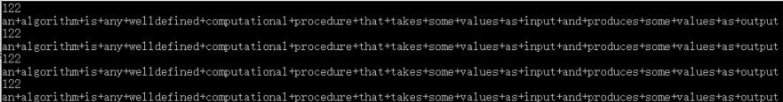
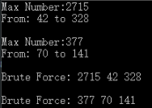
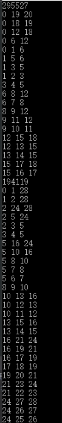
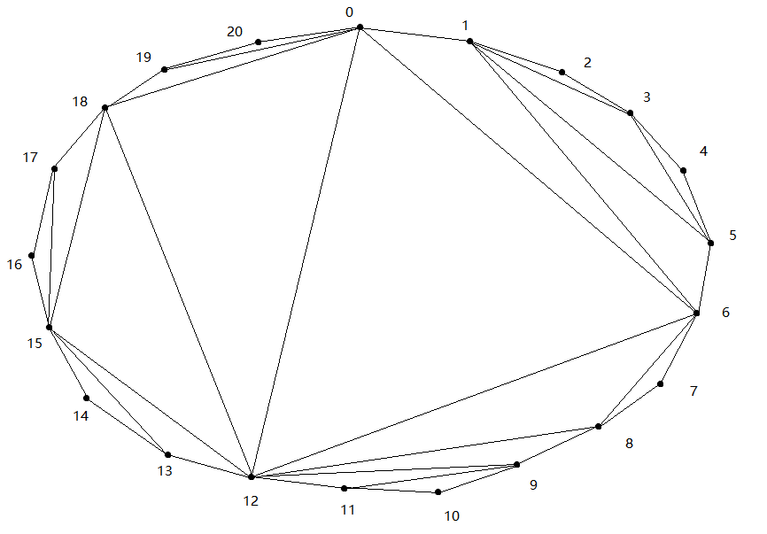
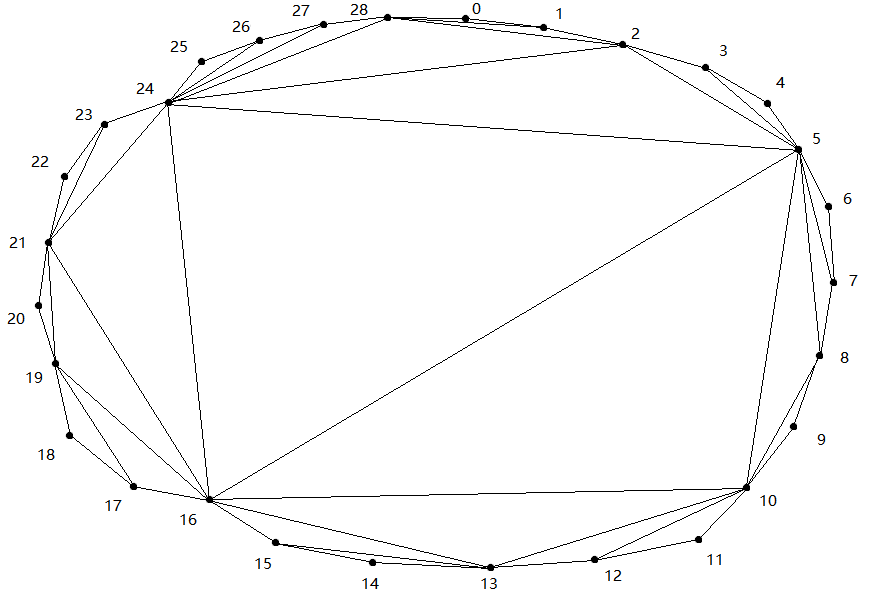
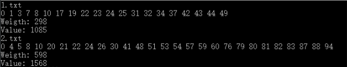

# 算法设计与分析 第2章

> 2016211308班 2016211352号 刘思聪

[GitHub链接](https://github.com/LiuSecone/Data-Structure/tree/master/aa-chapter3)

---

## 最长公共子序列

* 使用`DP`，最长公共子序列的算法时间为O(mn)。

### 实验截图

> 截图中四条公共子序列，依次为`a-b`，`c-d`，`a-d`，`b-c`



### 实验代码

```C++
#include <iostream>
#include <string>
#include <fstream>
#include <vector>

#define LENGTH 2000

void get_string(std::string &a, std::string &b, std::string &c, std::string &d) {
    std::ifstream input("lcs.txt");
    if (!input) {
        std::cout << "Can not open file." << std::endl;
        return;
    }
    std::string temp;
    input >> temp;
    input >> a;
    input >> temp;
    input >> b;
    input >> temp;
    input >> c;
    input >> temp;
    input >> d;
    input.close();
    return;
}

void lcs(const std::string &str1, const std::string &str2) {
    std::vector<std::vector<int>> dp_map(LENGTH, std::vector<int>(LENGTH, 0));
    for (unsigned int i = 1; i <= str1.length(); ++i) {
        for (unsigned int j = 1; j <= str2.length(); ++j) {
            if (str1[i - 1] == str2[j - 1]) {
                dp_map[i][j] = dp_map[i - 1][j - 1] + 1;
            }
            else {
                if (dp_map[i][j - 1] > dp_map[i - 1][j]) {
                    dp_map[i][j] = dp_map[i][j - 1];
                }
                else {
                    dp_map[i][j] = dp_map[i - 1][j];
                }
            }
        }
    }
    std::cout << dp_map[str1.length()][str2.length()] << std::endl;
    std::string ans;
    auto i = str1.length();
    auto j = str2.length();
    while (i != 0 && j != 0) {
        if (str1[i - 1] == str2[j - 1]) {
            ans = str1[i - 1] + ans;
            --i;
            --j;
        }
        else {
            if (dp_map[i][j - 1] > dp_map[i - 1][j]) {
                --j;
            }
            else {
                --i;
            }
        }
    }
    std::cout << ans << std::endl;
    return;
}

int main() {
    std::string a, b, c, d;
    get_string(a, b, c, d);
    lcs(a, b);
    lcs(c, d);
    lcs(a, d);
    lcs(c, b);
    system("pause");
    return 0;
}
```

---

## 最大子段和

* 使用`动态规划`，时间效率为O(n)。
* 使用`二分法`，时间效率为O(nlog<sub>2</sub>n)。
* 使用`暴力法`，时间效率O(n<sup>2</sup>)。

### 实验截图

> 本题中第二组数据，因为第70号数为0，因此存在两种最优解：70~141 or 71-141。



### 实验代码

``` C++
#include <iostream>
#include <vector>
#include <string>
#include <fstream>
#include <algorithm>

void get_data(std::vector<int> &data, const std::string &file_name) {
    std::ifstream input(file_name);
    if (!input) {
        std::cout << "Can not open file: " << file_name << std::endl;
        return;
    }
    int temp;
    while (input >> temp) {
        data.push_back(temp);
    }
    input.close();
    return;
}

void max_sum(const std::vector<int> &data) {
    std::vector<int> dp_map(data.size(), 0);
    dp_map[0] = data[0];
    auto ans = 0;
    for (auto i = 1; i < static_cast<int>(dp_map.size()); ++i) {
        dp_map[i] = std::max(dp_map[i - 1] + data[i], data[i]);
        if (dp_map[ans] < dp_map[i]) {
            ans = i;
        }
    }
    std::cout << "Max Number:" << dp_map[ans] << std::endl;
    int range_l, range_r;
    range_r = ans;
    while (dp_map[ans] >= 0) {
        --ans;
    }
    ++ans;
    range_l = ans;
    std::cout << "From: " << range_l << " to " << range_r << std::endl;
    std::cout << std::endl;
    return;
}

void brute(const std::vector<int> &data) {
    int max = data[0];
    int l = 0, r = 0;
    for (auto i = data.begin(); i != data.end(); ++i) {
        for (auto j = i; j != data.end(); ++j) {
            int sum = 0;
            for (auto k = i; k <= j; ++k) {
                sum += *k;
            }
            if (sum > max) {
                max = sum;
                l = i - data.begin();
                r = j - data.begin();
            }
        }
    }
    std::cout << "Brute Force: " << max << ' ' << l << ' ' << r << std::endl;
    std::cout << std::endl;
    return;
}

int main() {
    std::vector<int> data1, data2;
    get_data(data1, "max_sum1.txt");
    get_data(data2, "max_sum2.txt");
    max_sum(data1);
    max_sum(data2);
    brute(data1);
    brute(data2);
    system("pause");
    return 0;
}
```

---

## 凸多边形最优三角剖分

* 使用`DP`的凸多边形最优三角剖分的时间为O(n<sup>3</sup>)。

### 实验截图



### 三角剖分示意图

* 21点：

> 在此图中编号为0与20的点实质为同一点，可以合并为一点。因此总计为20个点。



* 29点：

> 在此图中编号为0与29的点实质为同一点，可以合并为一点。因此总计为28个点。



### 代码

``` C++
#include <iostream>
#include <vector>
#include <string>
#include <fstream>
#include <algorithm>

void get_data(std::vector<int> &data, const std::string &file_name) {
    std::ifstream input(file_name);
    if (!input) {
        std::cout << "Can not open file: " << file_name << std::endl;
        return;
    }
    int temp;
    while (input >> temp) {
        data.push_back(temp);
    }
    input.close();
    return;
}

void max_sum(const std::vector<int> &data) {
    std::vector<int> dp_map(data.size(), 0);
    dp_map[0] = data[0];
    auto ans = 0;
    for (auto i = 1; i < static_cast<int>(dp_map.size()); ++i) {
        dp_map[i] = std::max(dp_map[i - 1] + data[i], data[i]);
        if (dp_map[ans] < dp_map[i]) {
            ans = i;
        }
    }
    std::cout << "Max Number:" << dp_map[ans] << std::endl;
    int range_l, range_r;
    range_r = ans;
    while (dp_map[ans] >= 0) {
        --ans;
    }
    ++ans;
    range_l = ans;
    std::cout << "From: " << range_l << " to " << range_r << std::endl;
    std::cout << std::endl;
    return;
}

void brute(const std::vector<int> &data) {
    int max = data[0];
    int l = 0, r = 0;
    for (auto i = data.begin(); i != data.end(); ++i) {
        for (auto j = i; j != data.end(); ++j) {
            int sum = 0;
            for (auto k = i; k <= j; ++k) {
                sum += *k;
            }
            if (sum > max) {
                max = sum;
                l = i - data.begin();
                r = j - data.begin();
            }
        }
    }
    std::cout << "Brute Force: " << max << ' ' << l << ' ' << r << std::endl;
    std::cout << std::endl;
    return;
}

int main() {
    std::vector<int> data1, data2;
    get_data(data1, "max_sum1.txt");
    get_data(data2, "max_sum2.txt");
    max_sum(data1);
    max_sum(data2);
    brute(data1);
    brute(data2);
    system("pause");
    return 0;
}
```

---

## 0-1背包

* 使用`DP`的0-1背包时间效率为O(nc)
* 使用暴力的时间效率为O(2<sup>n</sup>)

## 运行截图



## 代码

``` C++
#include <iostream>
#include <vector>
#include <string>
#include <fstream>
#include <algorithm>

struct data {
    int weight;
    int value;
};

void bag(const std::string &file_name) {
    std::ifstream input(file_name);
    if (!input) {
        std::cout << "Can not open file: " << file_name << std::endl;
        return;
    }
    std::cout << file_name << std::endl;
    int total_weight;
    input >> total_weight;
    int temp;
    std::vector<int> temp_vec;
    while (input >> temp) {
        temp_vec.push_back(temp);
    }
    input.close();
    std::vector<struct data> things(temp_vec.size() >> 1);
    for (unsigned i = 0; i < temp_vec.size() >> 1; ++i) {
        things[i].weight = temp_vec[i];
        things[i].value = temp_vec[i + (temp_vec.size() >> 1)];
    }
    std::vector<std::vector<int>> dp_map(things.size(), std::vector<int>(total_weight + 1, 0));
    for (int i = 0; i < static_cast<int>(things.size()); ++i) {
        for (int j = 1; j <= total_weight; ++j) {
            if (i == 0) {
                if (things[i].weight <= j) {
                    dp_map[i][j] = things[i].value;
                }
            }
            else {
                if (things[i].weight <= j) {
                    dp_map[i][j] = std::max(dp_map[i - 1][j], dp_map[i - 1][j - things[i].weight] + things[i].value);
                }
                else {
                    dp_map[i][j] = dp_map[i - 1][j];
                }
            }
        }
    }
    std::vector<int> ans_stack;
    int i = things.size() - 1;
    int j = total_weight;
    while (i != -1 && j != 0) {
        if (i == 0) {
            if (things[i].weight <= j) {
                ans_stack.push_back(i);
                j -= things[i].weight;
                --i;
            }
        }
        else {
            if (things[i].weight <= j) {
                if (dp_map[i - 1][j] < dp_map[i - 1][j - things[i].weight] + things[i].value) {
                    ans_stack.push_back(i);
                    j -= things[i].weight;
                    --i;
                }
                else {
                    --i;
                }
            }
            else {
                --i;
            }
        }
    }
    int sum_weight = 0;
    while (!ans_stack.empty()) {
        sum_weight += things[ans_stack.back()].weight;
        std::cout << ans_stack.back() << ' ';
        ans_stack.pop_back();
    }
    std::cout << std::endl << "Weigth: " << sum_weight << std::endl;
    std::cout << "Value: " << dp_map[things.size() - 1][total_weight] << std::endl;
    return;
}
int main() {
    bag("1.txt");
    bag("2.txt");
    system("pause");
    return 0;
}
```