# 算法设计与分析 第4章

> 2016211308班 2016211352号 刘思聪

[GitHub链接](https://github.com/LiuSecone/Data-Structure/tree/master/aa-chapter4)

---

## 基于贪心法的凸多边形三角剖分

* 使用贪心策略，每一步选择当前最优的角色，但是不一定是全局最优的决策。因此构造出来的三角剖分一定是大于等于动态规划构造的三角剖分。

### 实验截图

* 截图中的前n-1行表示依次构造的三角剖分的三角形所使用的顶点。
第n行表示了构造的总代价。

> 21个顶点

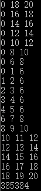

> 29个顶点

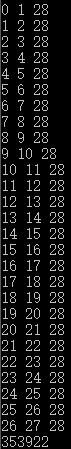

### 三角剖分示意图

> 21个顶点

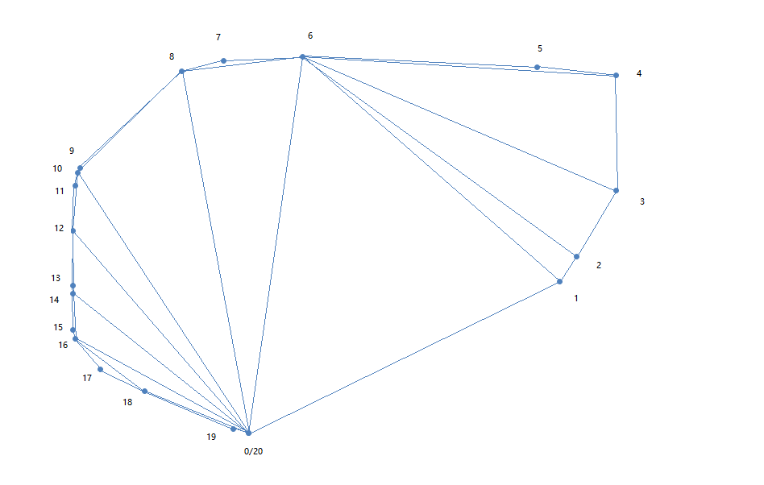

> 29个顶点

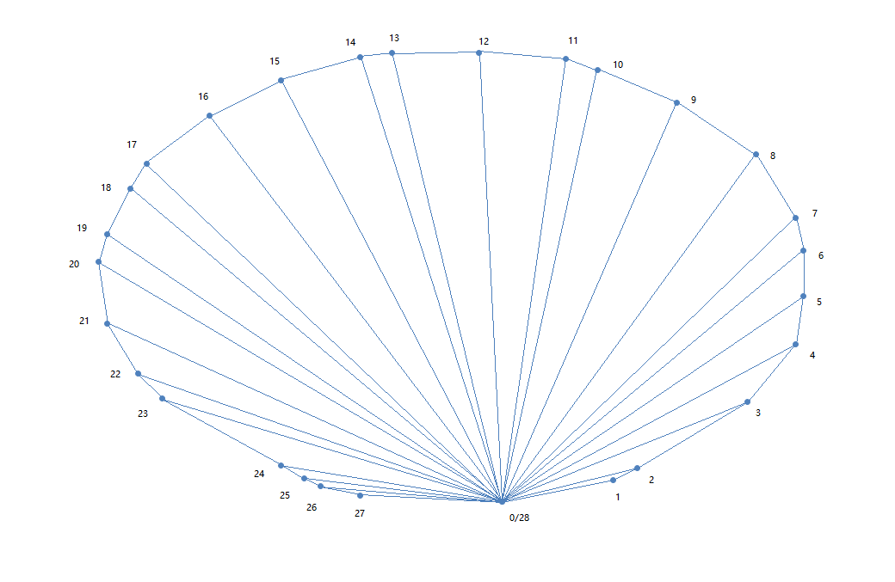

### 实验代码

```C++
#include <iostream>
#include <vector>
#include <fstream>
#include <string>
#include <limits>

#define PI 3.14159265
#define R 6.371229*1e6

struct node {
    int id;
    double longitude, latitude, k_dist;
    bool operator< (const node &exp) const {
        if (this->longitude != exp.longitude) {
            return this->longitude < exp.longitude;
        }
        else {
            return this->latitude < exp.latitude;
        }
    }
};

void get_data(std::vector<struct node> &data, const std::string &file_name) {
    std::ifstream input(file_name);
    if (!input) {
        std::cout << "Can not open file: " << file_name << std::endl;
        return;
    }
    struct node temp;
    while (input >> temp.id >> temp.longitude >> temp.latitude >> temp.k_dist) {
        data.push_back(temp);
    }
    input.close();
    return;
}

double get_rad(double d) {
    return (d * PI / 180);
}

double get_dist(const struct node &d1, const struct node &d2) {
    const auto lat1 = d1.latitude;
    const auto lat2 = d2.latitude;
    const auto lon1 = d1.longitude;
    const auto lon2 = d2.longitude;
    const auto rad_lat_1 = get_rad(lat1);
    const auto rad_lat_2 = get_rad(lat2);
    const auto a = rad_lat_1 - rad_lat_2;
    const auto b = get_rad(lon1) - get_rad(lon2);
    double dist = 2 * asin(sqrt(pow(sin(a / 2), 2) + cos(rad_lat_1)*cos(rad_lat_2)*pow(sin(b / 2), 2)));
    dist = dist * R;
    return dist;
}

double get_c(const struct node &a, const struct node &b, const struct node &c) {
    return get_dist(a, b) + get_dist(b, c) + get_dist(a, c);
}

int triangulation(const std::vector<struct node> &data, const int i, const int j) {
    if (j - i < 1) {
        return 0;
    }
    auto segment = i;
    for (auto k = i; k < j - 1; ++k) {
        if (get_c(data[i - 1], data[k], data[j]) < get_c(data[i - 1], data[segment], data[j])) {
            segment = k;
        }
    }
    std::cout << i - 1 << " " << segment << " " << j << std::endl;
    return get_c(data[i - 1], data[segment], data[j]) + triangulation(data, i, segment) + triangulation(data, segment + 1, j);
}

int main() {
    std::vector<struct node> data1, data2;
    get_data(data1, "21.txt");
    get_data(data2, "29.txt");
    auto ans = triangulation(data1, 1, 20);
    std::cout << ans << std::endl;
    ans = triangulation(data2, 1, 28);
    std::cout << ans << std::endl;
    system("pause");
    return 0;
}
```

---

## 哈夫曼编码

* 先构造`Huffman`树，然后 利用树生成编码。

### 实验截图

> 程序仅编码了`a`-`z`的小写字母以及`#`。
> 等长编码计算使用的是26个小写字母加一个特殊字符共27个字符。`4 < log(27) < 5`，因此5使用5位等长编码计算。

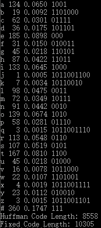

### 实验代码

```C++ 
#include <iostream>
#include <fstream>
#include <queue>
#include <string>
#include <vector>
#include <cctype>
#include <iomanip>
#include <functional>

#define FIXED_CODING_BIT 5

struct huffman_node {
    struct huffman_node *left = nullptr;
    struct huffman_node *right = nullptr;
    struct huffman_node *self = nullptr;
    bool is_leaf;
    int letter_num;
    int weight;
    bool operator > (const struct huffman_node &exp) const {
        return this->weight > exp.weight;
    }
};

std::vector<int> get_data(const std::string file_name) {
    std::vector<int> data(27, 0);
    std::ifstream input(file_name);
    if (!input) {
        std::cout << "Can not open file: " << file_name << std::endl;
        return data;
    }
    unsigned char ch;
    while (input >> ch) {
        if (ch == '#') {
            ++data[26];
        }
        if (std::islower(ch)) {
            ++data[ch - 'a'];
        }
    }
    return data;
}

void huffman(std::priority_queue<struct huffman_node, std::vector<huffman_node>, std::greater<huffman_node>> &huffman_tree) {
    while (huffman_tree.size() != 1) {
        const auto left = huffman_tree.top().self;
        huffman_tree.pop();
        const auto right = huffman_tree.top().self;
        huffman_tree.pop();
        const auto ptemp_node = new(struct huffman_node);
        ptemp_node->left = left;
        ptemp_node->right = right;
        ptemp_node->self = ptemp_node;
        ptemp_node->is_leaf = false;
        ptemp_node->weight = left->weight + right->weight;
        huffman_tree.push(*ptemp_node);
    }
    return;
}

void dfs(const struct huffman_node &node, std::vector<std::string> &ans, const std::string code) {
    if (node.is_leaf) {
        ans[node.letter_num] = code;
    }
    else {
        dfs(*(node.left), ans, code + "0");
        dfs(*(node.right), ans, code + "1");
    }
    return;
}

void output(const int letter_num, const std::string str, const int times, const int sum) {
    if (letter_num == 26) {
        std::cout << "#";
    }
    else {
        std::cout << static_cast<unsigned char>(letter_num + 'a');
    }
    std::cout << " " << std::setw(3) << times << " " << std::setprecision(4) << std::setiosflags(std::ios::fixed) << static_cast<double>(times) / static_cast<double>(sum) << " " << str << std::endl;
}

std::priority_queue<struct huffman_node, std::vector<huffman_node>, std::greater<huffman_node>> init_huffman_tree(const std::vector<int> &data) {
    std::priority_queue<huffman_node, std::vector<huffman_node>, std::greater<huffman_node>> huffman_tree;
    for (auto iter = data.begin(); iter != data.end(); ++iter) {
        const auto ptemp_node = new(struct huffman_node);
        ptemp_node->self = ptemp_node;
        ptemp_node->is_leaf = true;
        ptemp_node->letter_num = iter - data.begin();
        ptemp_node->weight = *iter;
        huffman_tree.push(*ptemp_node);
    }
    return huffman_tree;
}

int main() {
    const auto data = get_data("huffman.txt");
    auto huffman_tree = init_huffman_tree(data);
    huffman(huffman_tree);
    std::vector<std::string> ans(27, "");
    dfs(huffman_tree.top(), ans, "");
    auto sum = 0;
    for (const auto i : data) {
        sum += i;
    }
    for (auto iter = ans.begin(); iter != ans.end(); ++iter) {
        output(iter - ans.begin(), *iter, data[iter - ans.begin()], sum);
    }
    auto huffman_length = 0;
    auto fixed_length = 0;
    for (auto i = 0; i < 27; ++i) {
        huffman_length += data[i] * ans[i].length();
        fixed_length += data[i] * FIXED_CODING_BIT;
    }
    std::cout << "Huffman Code Length: " << huffman_length << std::endl;
    std::cout << "Fixed Code Length: " << fixed_length << std::endl;
    system("pause");
    return 0;
}
```

## 单源最短路

### 实验截图

> 22点

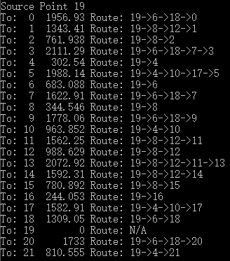

> 42点

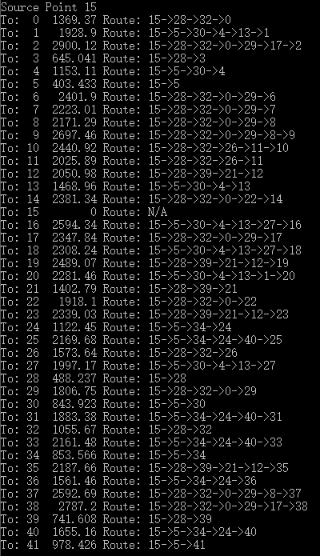

### 最短路示意图

> 22点
> 路径：19->6->18->0

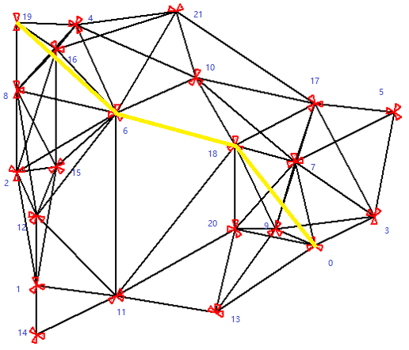

> 42点
> 路径：15->28->32->0->29->17->2

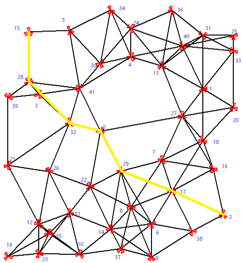

### 实验代码

```C++
#include <iostream>
#include <fstream>
#include <string>
#include <vector>
#include <queue>
#include <iomanip>
#include <functional>

#define INF 0x3f3f3f3f

std::vector<std::vector<double>> get_data(const int num) {
    std::vector<std::vector<double>> data(num, std::vector<double>(num, -1));
    const auto file_name = std::to_string(num) + ".txt";
    std::ifstream input(file_name);
    if (!input) {
        std::cout << "Can not open file: " << file_name << std::endl;
        return data;
    }
    for (auto i = 0; i < num; ++i) {
        for (auto j = 0; j < num; ++j) {
            input >> data[i][j];
            if (data[i][j] == -1) {
                data[i][j] = INF;
            }
        }
    }
    return data;
}

struct prio_queue_node {
    int id;
    double weight;
    bool operator < (const prio_queue_node exp) const {
        return this->weight < exp.weight;
    }
    bool operator > (const prio_queue_node exp) const {
        return this->weight > exp.weight;
    }
};

void dijkstra(const std::vector<std::vector<double>> &data, const int source_point) {
    auto next_point = source_point;
    std::vector<int> last_point(data.size(), -1);
    std::vector<double> dist(data.size(), INF);
    dist[source_point] = 0;
    std::priority_queue<prio_queue_node, std::vector<prio_queue_node>, std::greater<prio_queue_node>> queue;
    queue.push(prio_queue_node { source_point, dist[source_point] });
    while (!queue.empty()) {
        const auto cur_point = queue.top().id;
        queue.pop();
        for (auto iter = data[cur_point].begin(); iter != data[cur_point].end(); ++iter) {
            const auto refreshing_point = iter - data[cur_point].begin();
            if (*iter + dist[cur_point] < dist[refreshing_point]) {
                dist[refreshing_point] = *iter + dist[cur_point];
                last_point[refreshing_point] = cur_point;
                queue.push(prio_queue_node{ refreshing_point, dist[refreshing_point] });
            }
        }
    }
    std::cout << "Source Point " << source_point << std::endl;
    for (auto iter = dist.begin(); iter != dist.end(); ++iter) {
        auto cur_point = iter - dist.begin();
        std::cout << "To: " << std::setw(2) << cur_point << " " << std::setw(8) << *iter << " Route: ";
        if (last_point[cur_point] == -1) {
            std::cout << "N/A";
        }
        else {
            std::vector<int> route;
            while (cur_point != source_point) {
                route.push_back(cur_point);
                cur_point = last_point[cur_point];
            }
            std::cout << source_point;
            while (route.size()) {
                std::cout << "->" << route.back();
                route.pop_back();
            }
        }
        std::cout << std::endl;
    }
    std::cout << std::endl;
    return;
}

int main() {
    const auto data22 = get_data(22);
    const auto data42 = get_data(42);
    dijkstra(data22, 19);
    dijkstra(data42, 15);
    system("pause");
    return 0;
}
```

## 最小生成树

通过观察实验结果，可以看到`Prim`和`Kruskal`算法得到的最小生成树的结果是一样的

### 实验截图

> 22点

* Prim算法

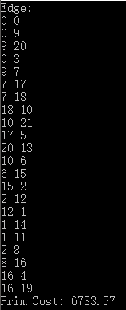

* Kruskal算法

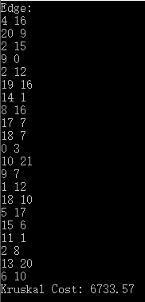

> 42点

* Prim算法

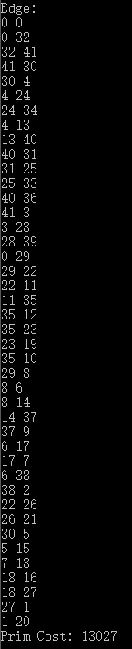

* Kruskal算法

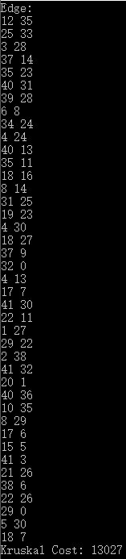

### 最小生成树示意图

* Prim算法

> 22点

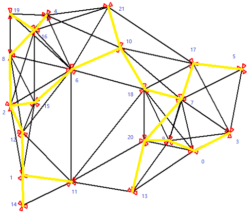

* Kruskal算法

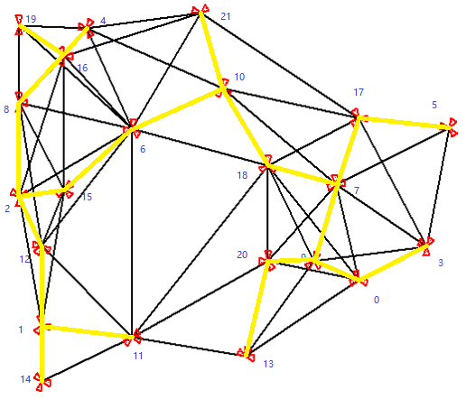

> 42点

* Prim算法

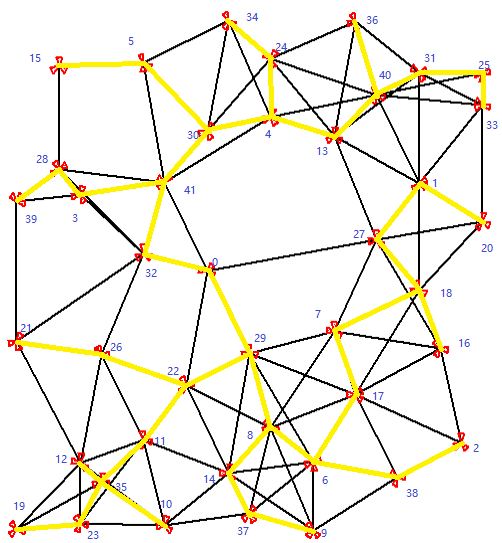

* Kruskal算法


### 实验代码

```C++
#include <iostream>
#include <fstream>
#include <string>
#include <vector>
#include <queue>
#include <functional>

#define INF 0x3f3f3f3f

std::vector<std::vector<double>> get_data(const int num) {
    std::vector<std::vector<double>> data(num, std::vector<double>(num, -1));
    const auto file_name = std::to_string(num) + ".txt";
    std::ifstream input(file_name);
    if (!input) {
        std::cout << "Can not open file: " << file_name << std::endl;
        return data;
    }
    for (auto i = 0; i < num; ++i) {
        for (auto j = 0; j < num; ++j) {
            input >> data[i][j];
            if (data[i][j] == -1) {
                data[i][j] = INF;
            }
        }
    }
    return data;
}

struct dist_to_mst {
    double dist;
    int point_no;
    int father;
    bool operator > (const dist_to_mst exp) const {
        return this->dist > exp.dist;
    }
};

void prim(const std::vector<std::vector<double>> &data) {
    const auto point_num = data.size();
    double dist_sum = 0;
    std::vector<bool> in_mst(point_num, false);
    std::vector<double> dist(point_num, INF);
    std::priority_queue<dist_to_mst, std::vector<dist_to_mst>, std::greater<dist_to_mst>> prio_queue;
    prio_queue.push(dist_to_mst{ 0, 0, 0 });
    std::cout << "Edge: " << std::endl;
    while (!prio_queue.empty()) {
        const auto cur_point = prio_queue.top();
        prio_queue.pop();
        if (in_mst[cur_point.point_no]) {
            continue;
        }
        std::cout << cur_point.father << " " << cur_point.point_no << std::endl;
        dist_sum += cur_point.dist;
        in_mst[cur_point.point_no] = true;
        for (auto iter = data[cur_point.point_no].begin(); iter != data[cur_point.point_no].end(); ++iter) {
            const auto arrive_point = iter - data[cur_point.point_no].begin();
            if (!in_mst[arrive_point] && *iter < dist[arrive_point]) {
                dist[arrive_point] = *iter;
                prio_queue.push(dist_to_mst{ *iter, arrive_point, cur_point.point_no });
            }
        }
    }
    std::cout << "Prim Cost: " << dist_sum << std::endl;
    std::cout << std::endl;
    return;
}

struct edge {
    int start;
    int end;
    double weight;
    bool operator > (const edge exp) const {
        return this->weight > exp.weight;
    }
};

int find_father(std::vector<int> &father, int son) {
    return father[son] == son ? son : father[son] = find_father(father, father[son]);
}

void kruskal(const std::vector<std::vector<double>> &data) {
    const auto point_num = data.size();
    double dist_sum = 0;
    std::vector<int> father(point_num, 0);
    for (auto iter = father.begin(); iter != father.end(); ++iter) {
        *iter = iter - father.begin();
    }
    std::priority_queue<edge, std::vector<edge>, std::greater<edge>> edges;
    std::vector<edge> mst;
    for (auto i = data.begin(); i != data.end(); ++i) {
        for (auto j = i->begin(); j != i->end(); ++j) {
            if (*j != INF) {
                edges.push(edge{ i - data.begin(), j - i->begin(), *j });
            }
        }
    }
    while (!edges.empty()) {
        const auto cur_edge = edges.top();
        edges.pop();
        const auto start_father = find_father(father, cur_edge.start);
        const auto end_father = find_father(father, cur_edge.end);
        if (start_father != end_father) {
            dist_sum += cur_edge.weight;
            father[end_father] = start_father;
            mst.push_back(cur_edge);
        }
    }
    std::cout << "Edge: " << std::endl;
    for (const auto i : mst) {
        std::cout << i.start << " " << i.end << std::endl;
    }
    std::cout << "Kruskal Cost: " << dist_sum << std::endl;
    std::cout << std::endl;
    return;
}

int main() {
    const auto data22 = get_data(22);
    const auto data42 = get_data(42);
    prim(data22);
    prim(data42);
    kruskal(data22);
    kruskal(data42);
    system("pause");
    return 0;
}
```