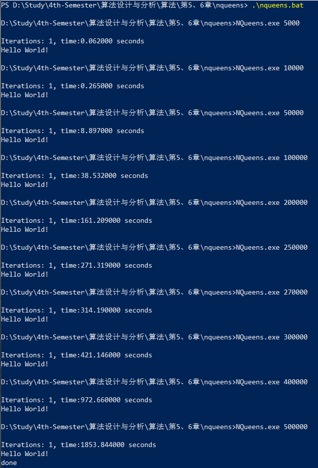
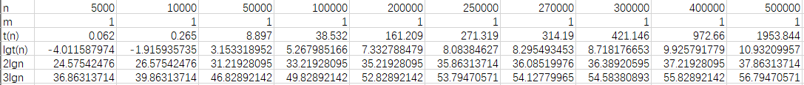
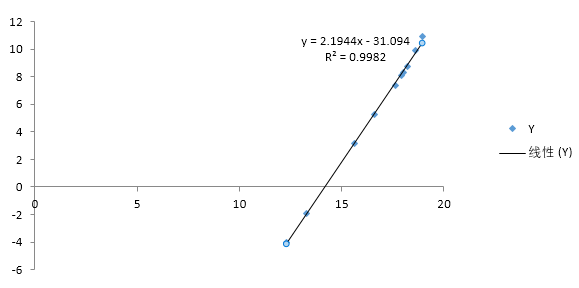
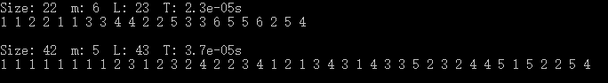
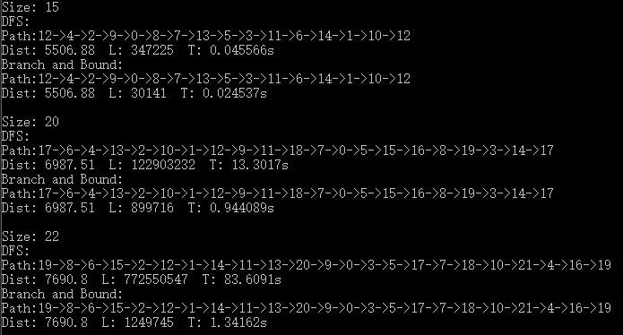

# 算法设计与分析 第5&6章

> 2016211308班 2016211352号 刘思聪

[GitHub链接](https://github.com/LiuSecone/Data-Structure/tree/master/aa-chapter5&6)

---

## N皇后问题

N皇后问题使用局部搜索方法求解。这里使用老师提供的代码运行并进行分析。

### 运行结果截图



### 做表、作图

计算中使用2为底。





通过excel得到线性回归方程：

> lgt(n) = 2.1944 * lgn - 31.094

## 图的m着色问题

图的m着色问题使用回溯法求解。

### 运行结果截图

> 使用数字标号代表颜色。



### 做表

|问题|用到的颜色数|搜索过的节点数|程序运行时间|
|:---:|:---:|:---:|:---:|
|22基站|6|23|2.3e-5|
|42基站|5|43|3.7e-5|

### 源代码

```C++
#include <string>
#include <iostream>
#include <vector>
#include <fstream>
#include <set>
#include <chrono>
#include <mutex>

#define INF 0x3f3f3f3f

int scaned_point = 0;

std::vector<std::vector<double>> get_data(const int num) {
    std::vector<std::vector<double>> data(num, std::vector<double>(num, -1));
    const auto file_name = std::to_string(num) + ".txt";
    std::ifstream input(file_name);
    if (!input) {
        std::cout << "Can not open file: " << file_name << std::endl;
        return data;
    }
    for (auto i = 0; i < num; ++i) {
        for (auto j = 0; j < num; ++j) {
            input >> data[i][j];
            if (data[i][j] == -1) {
                data[i][j] = INF;
            }
        }
    }
    return data;
}

bool dfs(const std::vector<std::vector<double>> &data, const int cur_point, std::vector<int> &point_color) {
    ++scaned_point;
    if (cur_point == data.size()) {
        return true;
    }
    std::set<int> around_color;
    for (auto iter = data[cur_point].begin(); iter != data[cur_point].end(); ++iter) {
        if (*iter != INF) {
            around_color.insert(point_color[iter - data[cur_point].begin()]);
        }
    }
    for (auto cur_color = 1; cur_color <= static_cast<int>(data.size()); ++cur_color) {
        if (around_color.count(cur_color) == 0) {
            point_color[cur_point] = cur_color;
            if (dfs(data, cur_point + 1, point_color) && point_color[data.size() - 1] != 0) {
                return true;
            }
        }
    }
    point_color[cur_point] = 0;
    return false;

}

void color(const std::vector<std::vector<double>> &data) {
    scaned_point = 0;
    std::vector<int> point_color(data.size(), 0);
    const auto start = std::chrono::system_clock::now();
    dfs(data, 0, point_color);
    const auto end = std::chrono::system_clock::now();
    auto duration = std::chrono::duration_cast<std::chrono::microseconds>(end - start);
    std::set<int> all_color;
    for (auto iter = point_color.begin(); iter != point_color.end(); ++iter) {
        all_color.insert(*iter);
    }
    std::cout << "Size: " << data.size() << "  m: " << all_color.size() << "  L: " << scaned_point << "  T: ";
    std::cout << static_cast<double>(duration.count()) * std::chrono::microseconds::period::num / std::chrono::microseconds::period::den << "s" << std::endl;
    for (auto i : point_color) {
        std::cout << i << " ";
    }
    std::cout << std::endl << std::endl;
    return;
}

int main() {
    const auto data22 = get_data(22);
    const auto data42 = get_data(42);
    color(data22);
    color(data42);
    system("pause");
    return 0;
}
```

## 旅行商问题

旅行商问题分别使用回溯法和分支界限法求解。

### 运行结果截图



### 做表

|问题和求解方法|最短回路|距离|节点总数|时间|
|:---:|:---:|:---:|:---:|:---:|
|15个基站回溯|12->4->2->9->0->8->7->13->5->3->11->6->14->1->10->12|5506.88|347225|0.045566|
|15个基站分支界限|12->4->2->9->0->8->7->13->5->3->11->6->14->1->10->12|5506.88|30141|0.024537|
|20个基站回溯|17->6->4->13->2->10->1->12->9->11->18->7->0->5->15->16->8->19->3->14->17|6987.51|122903232|13.3017|
|20个基站分支界限|17->6->4->13->2->10->1->12->9->11->18->7->0->5->15->16->8->19->3->14->17|6987.51|89716|0.944089|
|22个基站回溯|19->8->6->15->2->12->1->14->11->13->20->9->0->3->5->17->7->18->10->21->4->16->19|7690.8|772550547|83.6091|
|22个基站分支界限|19->8->6->15->2->12->1->14->11->13->20->9->0->3->5->17->7->18->10->21->4->16->19|7690.8|1249745|1.34162|

### 代码

```C++
#include <iostream>
#include <string>
#include <vector>
#include <fstream>
#include <chrono>
#include <queue>
#include <functional>

#define INF 0x3f3f3f3f

std::vector<std::vector<double>> get_data(const int num) {
    std::vector<std::vector<double>> data(num, std::vector<double>(num, -1));
    const auto file_name = std::to_string(num) + ".txt";
    std::ifstream input(file_name);
    if (!input) {
        std::cout << "Can not open file: " << file_name << std::endl;
        return data;
    }
    for (auto i = 0; i < num; ++i) {
        for (auto j = 0; j < num; ++j) {
            input >> data[i][j];
            if (data[i][j] == -1) {
                data[i][j] = INF;
            }
        }
    }
    return data;
}

void dfs(const std::vector<std::vector<double>> &data, const int &start_point, const int &cur_point, std::vector<int> &cur_path, const double &cur_dist, std::vector<int> &path, double &dist, int &scaned_point) {
    ++scaned_point;
    if (cur_dist >= dist) {
        return;
    }
    if (cur_path.size() == data.size() && cur_dist + data[start_point][cur_point] < dist) {
        cur_path.push_back(start_point);
        path = cur_path;
        dist = cur_dist + data[start_point][cur_point];
        cur_path.pop_back();
        return;
    }
    std::vector<bool> visited(data.size(), false);
    for (auto i : cur_path) {
        visited[i] = true;
    }
    for (auto iter = data[cur_point].begin(); iter != data[cur_point].end(); ++iter) {
        const auto next_point = static_cast<int>(iter - data[cur_point].begin());
        if (*iter != INF && !visited[next_point]) {
            cur_path.push_back(next_point);
            dfs(data, start_point, next_point, cur_path, cur_dist + *iter, path, dist, scaned_point);
            cur_path.pop_back();
        }
    }
}

struct point {
    int cur_point;
    double dist;
    double lower_bound;
    double rest_cost;
    std::vector<int> path;
    bool operator > (const point &exp) const {
        return this->lower_bound > exp.lower_bound;
    }
};

void branch(const std::vector<std::vector<double>> &data, const int &start_point, std::vector<int> &path, double &dist, int &scaned_point) {
    std::vector<double> bound(data.size(), INF);
    double bound_sum = 0;
    for (auto j = data.begin(), end_j = data.end(); j != end_j; ++j) {
        double min = INF;
        for(auto iter = j->begin(), end_iter = j->end(); iter != end_iter; ++iter) {
            if (*iter < min) {
                min = *iter;
            }
        }
        bound[j - data.begin()] = min;
        bound_sum += min;
    }
    std::priority_queue<struct point, std::vector<point>, std::greater<point>> prio_q;
    path.push_back(start_point);
    prio_q.push(point{ start_point, 0, bound_sum, bound_sum, path });
    while (!prio_q.empty()) {
        ++scaned_point;
        auto cur = prio_q.top();
        prio_q.pop();
        if (cur.path.size() == data.size()) {
            if (cur.dist + data[cur.cur_point][start_point] < dist) {
                dist = cur.dist + data[cur.cur_point][start_point];
                path = cur.path;
                path.push_back(start_point);
            }
        }
        else {
            if (cur.lower_bound < dist) {
                std::vector<bool> visited(data.size(), false);
                for (auto i : cur.path) {
                    visited[i] = true;
                }
                for (auto iter = data[cur.cur_point].begin(), end_iter = data[cur.cur_point].end(); iter != end_iter; ++iter) {
                    const auto next_point = static_cast<int>(iter - data[cur.cur_point].begin());
                    const auto lower_bound = cur.dist + *iter + cur.rest_cost - bound[cur.cur_point];
                    if (*iter != INF && !visited[next_point] && lower_bound < dist) {
                        cur.path.push_back(next_point);
                        prio_q.push(point{ next_point, cur.dist + *iter, lower_bound, cur.rest_cost - bound[cur.cur_point], cur.path });
                        cur.path.pop_back();
                    }
                }
            }
        }
    }
    return;
}

void output(const std::string &name, const std::vector<int> &path, const double &dist, const int &scaned_point, const double seconds) {
    std::cout << name << ": " << std::endl << "Path:";
    for (auto iter = path.begin(); iter != path.end(); ++iter) {
        std::cout << *iter;
        if (iter != path.end() - 1) {
            std::cout << "->";
        }
    }
    std::cout << std::endl;
    std::cout << "Dist: " << dist << "  L: " << scaned_point << "  T: ";
    std::cout << seconds * std::chrono::microseconds::period::num / std::chrono::microseconds::period::den;
    std::cout << "s" << std::endl;
}

void tsp(const std::vector<std::vector<double>> &data, const int start_point) {
    std::cout << "Size: " << data.size() << std::endl;
    auto scaned_point = 0;
    double dist = INF;
    std::vector<int> path;
    path.push_back(start_point);
    auto cur_path = path;
    auto start = std::chrono::system_clock::now();
    dfs(data, start_point, start_point, cur_path, 0, path, dist, scaned_point);
    auto end = std::chrono::system_clock::now();
    auto duration = std::chrono::duration_cast<std::chrono::microseconds>(end - start);
    output("DFS", path, dist, scaned_point, static_cast<double>(duration.count()));

    scaned_point = 0;
    path.clear();
    dist = INF;
    start = std::chrono::system_clock::now();
    branch(data, start_point, path, dist, scaned_point);
    end = std::chrono::system_clock::now();
    duration = std::chrono::duration_cast<std::chrono::microseconds>(end - start);
    output("Branch and Bound", path, dist, scaned_point, static_cast<double>(duration.count()));
    std::cout << std::endl;
    return;
}

int main() {
    const auto data15 = get_data(15);
    const auto data20 = get_data(20);
    const auto data22 = get_data(22);
    tsp(data15, 12);
    tsp(data20, 17);
    tsp(data22, 19);
    system("pause");
    return 0;
}
```